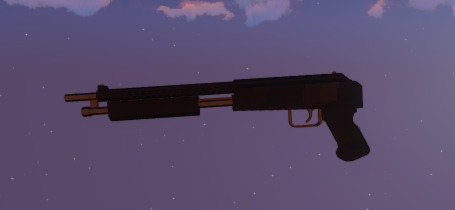
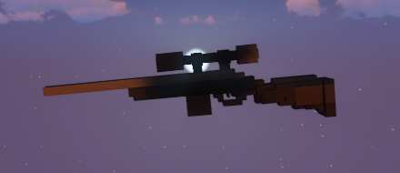

# Steenfield

Die Steenfield ist eine von fünf Schusswaffen, welche es auf dem Server gibt. Die Steeenfield ist eine Pumpgun die ein Cooldown von ca. 3 Sekunden hat, für die das Normale Magazin benötigt wird. Ihr Magazin umfasst 5 Schuss. Desweiteren kann die Waffe mit Waffenaddons ausgestattet werden. Die Waffe ist ein Fraktionsgebundesnes Item, welches man nur erhalten kann wenn man in einer Crimefraktion tätig ist.  

## Erhalten einer Shotgun

Die Steenfield kann an Equippunkten der Crimefraktionen abgeholt werden. Die Waffe kostet 1250€. Vorausetzung hierfür ist eine Waffenlizenz, welche in der [Stadthalle](../../orte/stadthalle.md) beantragt wird. Die Munition wird in den Waffenläden verkauft.

## Verwendung

Die Steenfield wird in Schießereien gebraucht, um eine bessere Verteidigung sicherzustellen. Die Waffe verursacht an Spielern einen Schaden von 6,5 ❤️.

# RTB-X

Die RTB-X ist eine von fünf Schusswaffen, welche es auf dem Server gibt.
Die RTB-X ist eine Sniper die ein Cooldown von ca. 4 Sekunden hat, für die das Normale Magazin benötigt wird. Ihr Magazin umfasst 5 Schuss. Desweiteren kann die Waffe mit Waffenaddons ausgestattet werden. Die Waffe ist ein Fraktionsgebundenes Item, welches man nur erhalten kann wenn man in der [Polizei](../../fraktionen/polizei.md) als S.E.K Beamter tätig ist.  

## Erhalten einer Sniper

Die RTB-X kann an Equippunkten der [Polizei](../../fraktionen/polizei.md) abgeholt werden. Die Waffe kostet 1250€. Voraussetzung hierfür ist eine Waffenlizenz, welche in der [Stadthalle](../../orte/stadthalle.md) beantragt wird.
Die Munition wird in den Waffenläden verkauft.

## Verwendung

Die RTB-X wird in Schießereien gebraucht, um eine bessere Verteidigung sicherzustellen. Die Waffe verursacht an Spielern einen Schaden von 7 ❤️.
