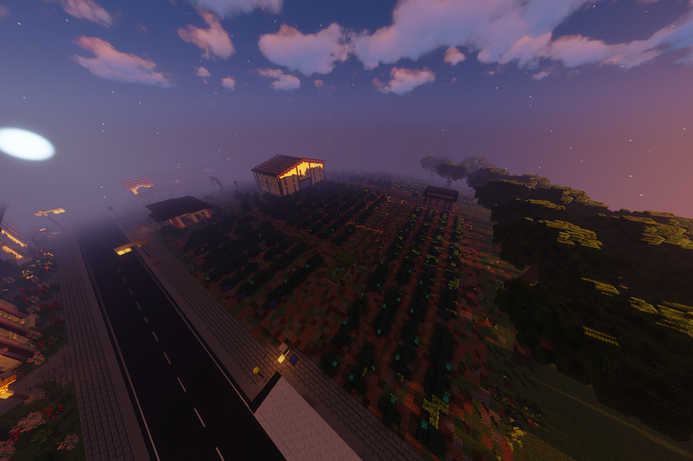

# Agavenfarmer (Nebenjob)
Der Agavenfarmer ist ein Nebenjob, welcher am Truck bei der Agavenfarm gestartet wird. Ziel dieses Nebenjobs ist es die Agaven an den Büschen auf der Farm zu pflücken. 

| <!-- --> | <!-- --> |
| :-: | :-: |
| [Bushaltestelle](../../pages/öpnv/bus.md) | Plaza |
| Navi | /navi Agavenfarm |
| Dauer | ca. 2 Minuten |
| Cooldown | 7 Minuten |
| Gewinn | Geld, [XP](../../pages/allgemein/level.md), [Farming-XP](../../pages/skills/farming.md) |

## Aufgaben

1. Der Nebenjob startet am Truck in den Agavenfeldern mit **/agavenfarmer**.
2. Baue nun die Agaven ab.
3. Wiederhole den Vorgang bis der Nebenjob beendet ist.
