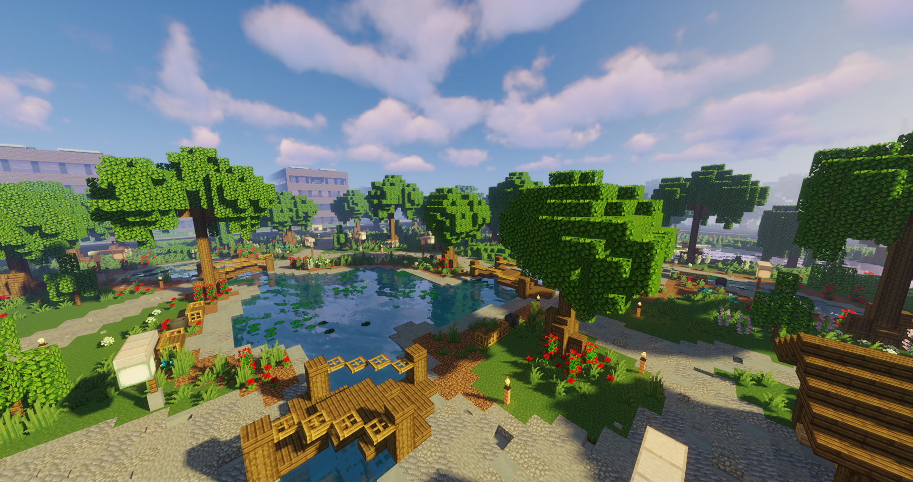
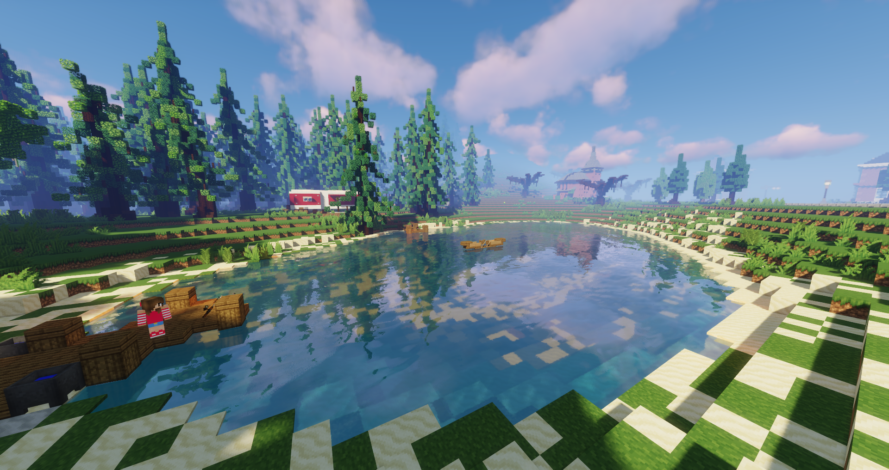

# Angler

Der erste Anglerteich (**/navi Angler**) befindet sich in [Downtown](../../pages/gebiete/downtown.md), nahe der Uniklinik und der gleichnamigen [Haltestelle](../../pages/öpnv/bus.md). In der kleinen Hütte in der Mitte des Parks befindet sich der NPC 
Walter. Der zweite Anglerteich befindet sich im [Reichenviertel](../../pages/gebiete/reichenviertel.md) beim Campingplatz (**/navi Campingplatz**). Waltraud, der NPC, ist auf dem Steg zu finden. Angeln darf man überall und ist nicht gezwungen, an einem Ort zu bleiben. Das Angeln von Fischen gewährt einem [Erfahrungspunkte](../../pages/allgemein/level.md), Geld, [Fischer-XP](../../pages/skills/fischer.md) und [Sozial-XP](../../pages/skills/social.md). 

## Ablauf
Die Arbeit beim Angeln funktioniert mit den folgenden Punkten:

- Gehe zum NPC Walter/Waltraud und kaufe eine Angel. 
- Nun muss mit der Angel die Fische aus dem Wasser geangelt werden.
- Es können sieben verschiedene Items im Inventar landen: 
    - Glasscherben 
    - Roher Fisch
    - Roher Lachs
    - Roher Clownfisch
    - Roher Pufferfisch
    - Haltbarkeitsverbesserung
    - XP-Verbesserung
- Am Ende die Fische, Haltbarkeitsverbesserung und XP-Verbesserung beim NPC verkaufen
- Glasscherben im Mülleimer entsorgen

Diese Items werden unterschiedlich verwertet: 

* Glasscherben: Die Glasscherben können mit Rechtsklick auf einen Mülleimer entsorgt werden. Dies bringt Social-XP.
* Fische: Die Fische können beim NPC verkauft werden. Dies generiert Erfahrungspunkte und Fischer-XP.
* Haltbarkeitsverbesserung: Kann verkauft werden oder auf eine neue Angel angebracht werden.
* XP-Verbesserung: Kann verkauft werden oder auf eine neue Angel angebracht werden.

## Angel
| Angel | Preis | Verzauberung | Benötigtes Skill Level |
| :-: | :-: | :-: | :-: |
| Angel für Anfänger | 20.0€ | Keine | Level 0 |
| Angel für Fortgeschrittene | 100.0€ | Geschwindigkeit +20% | Level 1 |
| Angel für Experten | 300.0€ |  Geschwindigkeit +30% | Level 3 |
| Angel für Profis | 420.0€ |  Geschwindigkeit +50% | Level 8 |
| Angel für Meister | 525.0€ |  Geschwindigkeit +70% | Level 15 |

### Verbesserungen
| Name | Preis | Effekt | Stackbar? |
| :-: | :-: | :-: | :-: |
| Haltbarkeitsverbesserung	| 100.0€ | Verbessert die Haltbarkeit der Angel | Maximal 3 Haltbarkeitsverbesserungen können auf eine Angel gepackt werden. |
| XP-Verbesserung | 5.230.0€ | Verbessert die Fischerskill-XP | Nein |

### Verkauf von Fischeritems

| Item | Verkaufspreis pro Stück |
|:-:|:-:|
| Roher Fisch | 2.0€ |
| Roher Lachs | 8.0€ |
| Roher Clownfisch | 12.0€ |
| Roher Pufferfisch | 35.0€ |
| Haltbarkeitsverbesserung | 100.0€ |
| XP-Verbesserung | 1.615.0€ |

## Hilfreiche Tipps

* Je höher der Fischer Skill Level ist, desto bessere Fische und Angeln erhält man.
* Der [Papagei](../../pages/pets/papagei.md) und das [Capybara](../../pages/pets/capybara.md) Pet unterstützt die Arbeit beim Fischen.
* Für Neulinge ist die Angel für Anfänger am effizientesten.

