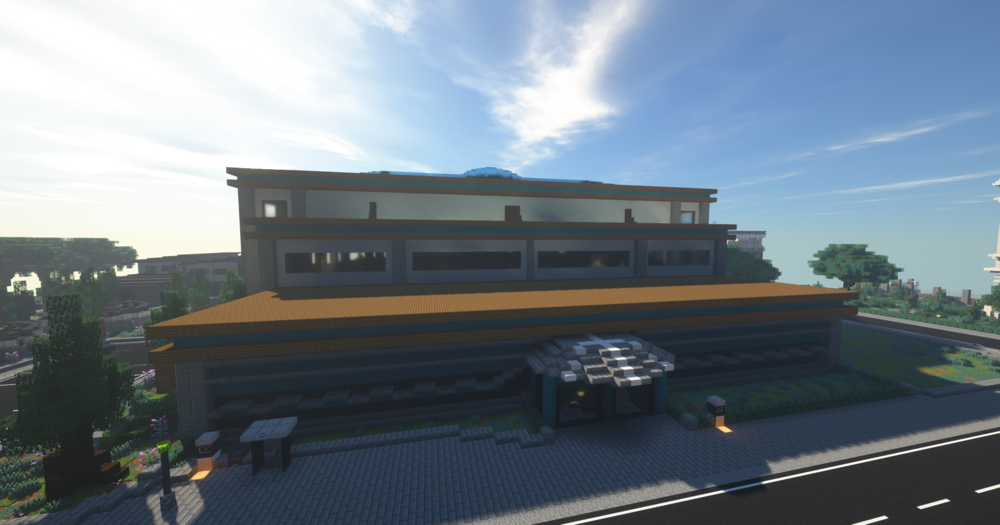

# Bademeister (Nebenjob)
Der Bademeister ist ein Nebenjob, welcher im Hallenbad ausgeführt werden kann. Im großen Schwimmbecken sind mehrere Senioren am Ertrinken. Diese müssen dann aus dem Schwimmbecken gerettet werden. 

| <!-- --> | <!-- --> |
| :-: | :-: |
| [Bushaltestelle](../../pages/öpnv/bus.md) | Hallenbad |
| Navi | /navi Schwimmbad |
| Dauer | ca. 5 Minuten |
| Cooldown | 7 Minuten |
| Gewinn | Geld, [XP](../../pages/allgemein/level.md), [Social-XP](../../pages/skills/social.md) |

## Aufgabe
1. Der Nebenjob wird im Schwimmbad gestartet mit **/bademeister**.
2. Im Schwimmbecken taucht dann ein markierter Kopf "Badegast" auf. Zu diesem muss man dann schwimmen um die Person zu retten.
3. Wiederhole den Vorgang bis der Nebenjob beendet ist.
