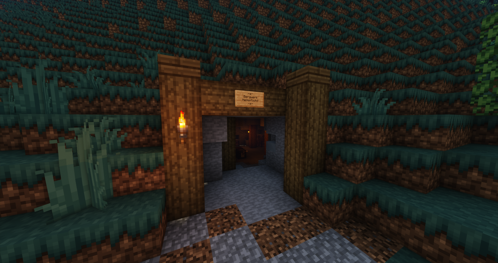

# Bergwerk

Das Bergwerk befindet sich im zwischen Downtown und Gangviertel, dessen nächstgelegene [Bushaltestelle](../../pages/öpnv/Bus.md) Uniklinik ist und ihr Navipunkt ist **/navi Bergwerk**.
Im Bergwerk kann als Minenarbeiter gearbeitet werden. Diese Arbeit gewährt einem Erfahrungspunkte, Geld, [BergbauXP](../../pages/skills/bergbau.md) und [SozialXP](../../pages/skills/social.md). 

## Ablauf

Die Arbeit im Bergwerk funktioniert mit den folgenden Punkten.

- Gehe zum NPC Tashi und kaufe eine Spitzhacke. 
- Nun müssen die Eisenerze in der Mine gefällt werden.
- Es können drei verschiedene Items im Inventar landen: 
      - Kieselsteine 
      - Eisenerz
      - Rohes Eisenerz
- Am Ende die Eisenerze am Eingang beim Entschlacker entschlacken und verkaufen
- Kieselsteine im Mülleimer entsorgen

Diese Items werden unterschiedlich verwertet: 

* Kieselsteine: Die Kieselsteine können mit Rechtsklick auf einen Mülleimer entsorgt werden. Dies bringt SocialXP.
* Eisenerz: Das Eisenerz kann beim Entschlacker entschlackert werden. Dies generiert Erfahrungspunkte und BergbauXP.
* Rodes Eisen: Diese können beim Entschlacker zu ? verarbeitet oder direkt verkauft werden. Die ? werden dann im Möbelhaus verkauft (**/navi Möbelhaus**). Dies generiert Erfahrungspunkte, BergbauXP und Geld.

## Spitzhacke

| Axt | Preis | Verzauberung | Benötígtes Skill Level |
| :-: | :-: | :-: | :-: |
| Spitzhacke für Anfänger | 20€ | Keine | Level 0 |
| Spitzhacke für Fortgeschrittene | 50€ | Effizienz 1 | Level 1 |
| Spitzhacke für Experten | 75€ | Effizienz 2 | Level 3 |
| Spitzhacke für Profis | 115€ | Effizienz 3 | Level 10 |
| Spitzhacke für Meister | 175€ | Effizienz 4 | Level 15 |

## Hilfreiche Tipps

* Je höher der Bergbau Skill Level ist, desto bessere Items und Spitzhacken erhält man.
* Das [Fledermaus](../../pages/pets/fledermaus.md) Pet unterstützt die Arbeit im Bergbau.
* Abgebaute Eisenerze färben sich grau und regenerieren sich nach kurz Zeit von selbst.
* Für Neulinge ist die Spitzhacke für Anfänger am Effizientesten.
