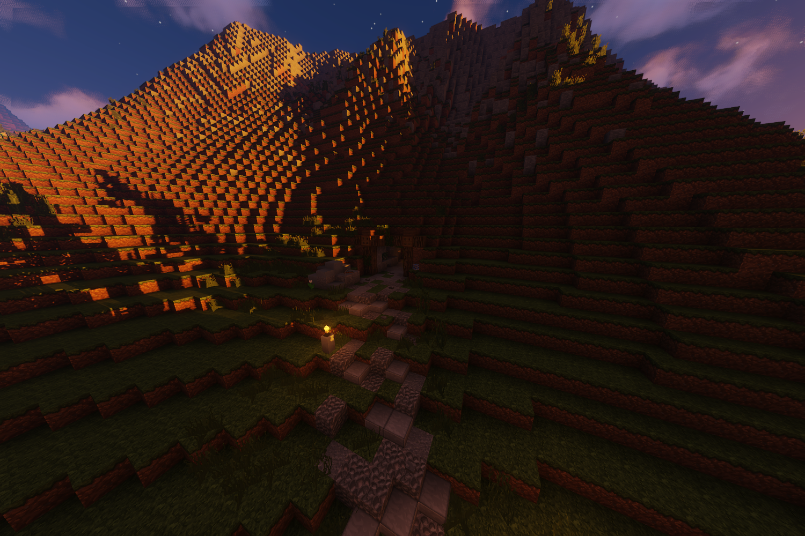

# Erztransport (Nebenjob)
Der Erztransport ist ein Nebenjob, welcher beim Salzbergwerk gestartet wird. 

| <!-- --> | <!-- --> |
| :-: | :-: |
| Bushaltestelle | Ganggebiet |
| Navi | /navi Salzbergwerk |
| Dauer | ca. 5 Minuten |
| Cooldown | 10 Minuten |
| Gewinn | Geld, XP, [Bergbau-XP](../..//pages/Skills/bergbau.md) |

## Aufgabe
Liefere die Erze zum Schmelzwerk.
