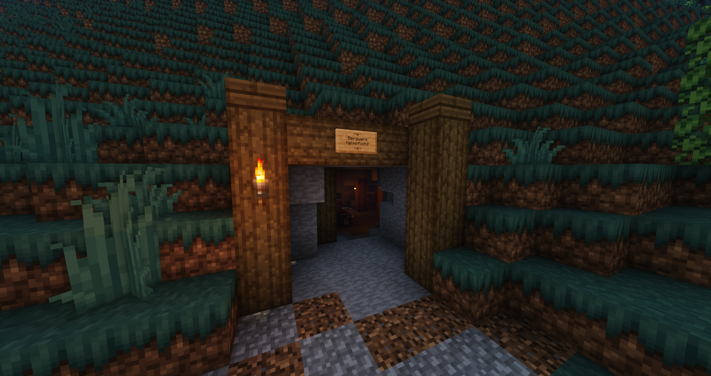

# Erztransport (Nebenjob)
> [!IMPORTANT]
> Aktuell ist der Job nicht ausführbar. (Stand 3.03.2025)

Der Erztransport ist ein Nebenjob, welcher beim Salzbergwerk gestartet wird. Einem werden mehrere Erzkisten gegeben, welche zum Schmelzwerk gebracht werden müssen.  

| <!-- --> | <!-- --> |
| :-: | :-: |
| [Bushaltestelle](../../pages/öpnv/bus.md) | Uniklinik |
| [Navi](../../pages/allgemein/navigation.md) | /navi Bergwerk |
| Dauer | ca. - Minuten |
| Cooldown | 10 Minuten |
| Gewinn | Geld, [Erfahrungspunkte](../../pages/allgemein/level.md), [Bergbau-XP](../../pages/skills//bergbau.md) |

## Aufgabe
1. Im Eingang des Salzbergwerkes **/erztransport** eingeben.
2. Ein Navi zeigt nun den Weg zum Schmelzwerk. Folge dem Navi.
3. Beim Schmelzwerk angekommen, muss man alle Erzkisten mit **/droptransport** abgeben. Dieser Befehl muss so lange eingegeben werden, bis alle Erzkisten abgeliefert sind.
