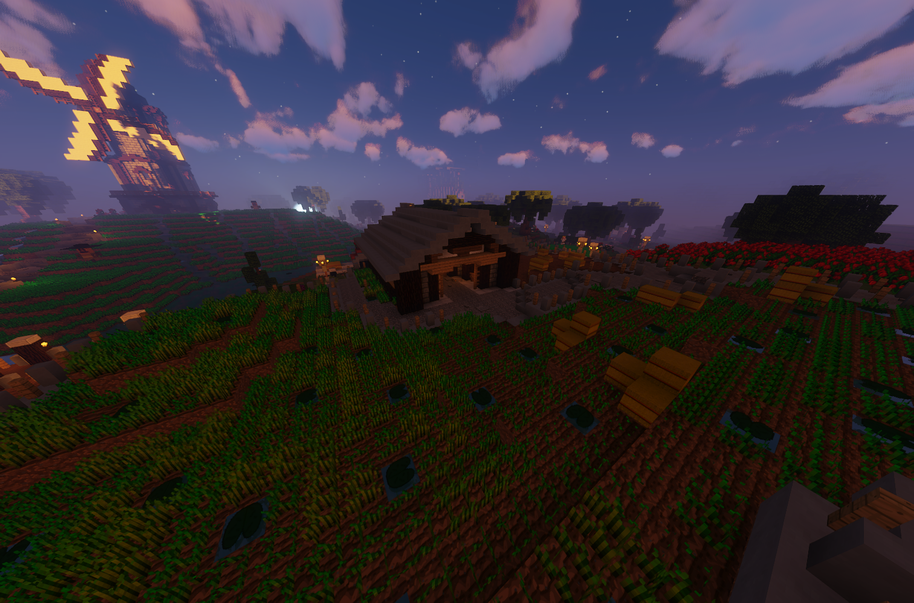

# Farmer (Nebenjob)
Der Farmer ist ein Nebenjob, welcher sich direkt an der Farm befindet. Eine Reihe an Heuballen müssen verwertet, eingesammelt und dem Farmer NPC abgeben werden. 

| | |
|:-:|:-:|
| [Bushaltestelle](../../pages/öpnv/bus.md) | Farm |
| [Navi](../../pages/allgemein/navigation.md) | /navi Farm |
| Dauer | ca. 2 Minuten |
| Cooldown | 7 Minuten |
| Gewinn | Geld, [Erfahrungspunkte](../../pages/allgemein/level.md), [Farming-XP](../..//pages/skills/farming.md) |

## Aufgaben
1. In der kleinen Holzhütte am Weizenfeld **/farmer** eingeben.
2. Man erhält eine Schere ins Inventar.
3. Mit der Schere die Heuballen abbauen.
4. Das gesammelte Weizen in der Hütte bei der Windmühle mit Rechtsklick auf den Farmer NPC abgeben.
