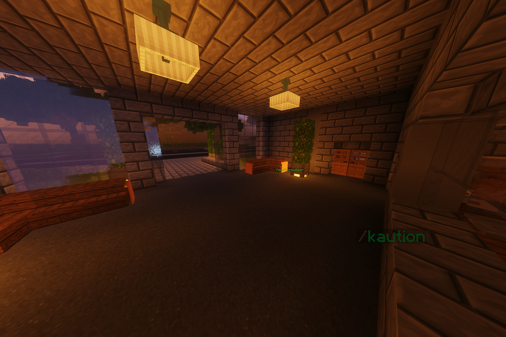

# Fensterputzer (Nebenjob)
Der Fensterputzer ist ein Nebenjob, welcher bei der JVA ausgeführt wird. In der Einganghalle werden die Fensterscheiben von den Besuchenden sehr verschmutzt und müssen wieder geputzt werden. 

| <!-- --> | <!-- --> |
| :-: | :-: |
| [Bushaltestelle](../../pages/öpnv/bus.md) | [Justizvollzugsanstalt](../../pages/orte/jva.md) |
| Navi | /navi [JVA](../../pages/orte/jva.md) |
| Dauer | ca. 1 Minuten |
| Cooldown | 7 Minuten |
| Gewinn | Geld, [XP](../../pages/allgemein/level.md), [Social-XP](../../pages/skills/social.md) |

## Aufgabe
1. Der Nebenjob wird mit **/fensterputzer** gestartet.
2. An der Fensterfront erscheint nun eine braune Glasscheibe.
3. Diese Glasscheibe muss abgebaut werden, dann erscheint die nächste braune Glasscheibe.
4. Baue die braunen Glasscheiben solange ab, bis der Nebenjob beendet ist.
