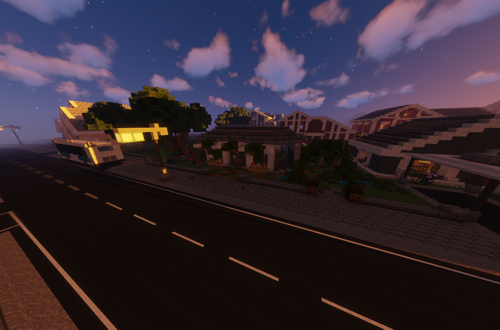

# Gärtner (Nebenjob)
Der Gärtner ist ein Nebenjob bei der Gärtnerei, der beim NPC gestartet wird.

| <!-- --> | <!-- --> |
| :-: | :-: |
| Bushaltestelle | Farm |
| Navi | /navi Gärtner |
| Dauer | ca. 1 Minuten |
| Cooldown | 6 Minuten |
| Gewinn | Geld, XP, [Gärtner-XP](../../pages/skills/gärtner.md) |

## Aufgaben
1. Fülle deine Gießkanne mit Wasser auf.
2. Wässere 6 Blumen 
