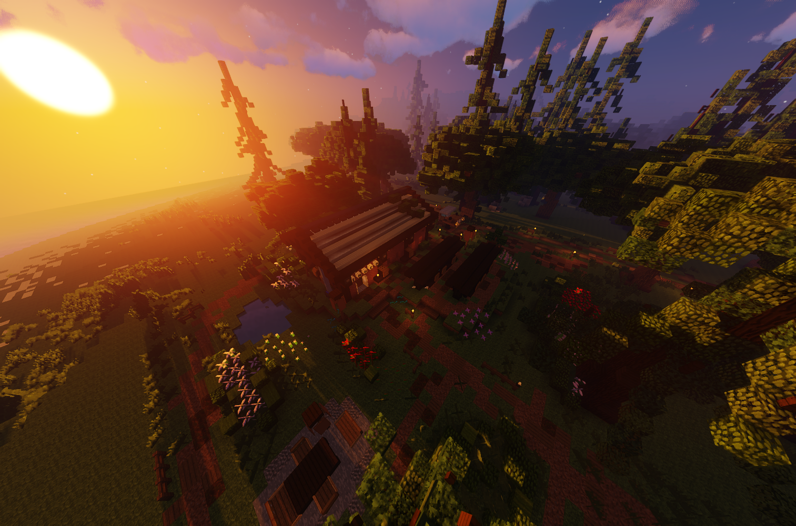

# Imker (Nebenjob)
Der Imker ist ein Nebenjob, welcher beim Imker NPC gestartet wird. Helfe dem Imker, den Honig aus den Bienenstöcken zu entnehmen. 

| <!-- --> | <!-- --> |
| :-: | :-: |
| [Bushaltestelle](../../pages/öpnv/bus.md) | [County](../../pages/gebiete/county.md) |
| [Navi](../../pages/allgemein/navigation.md) | /navi Imker |
| Dauer | ca. 3 Minuten |
| Cooldown | 4 Minuten |
| Gewinn | Geld, [Erfahrungspunkte](../../pages/allgemein/level.md), [Farming-XP](../../pages/skills/farming.md) |

## Aufgabe
1. Im Haus den Imker NPC mit Rechtsklick anklicken und die Biene auswählen.
2. Das Inventar wird um einen Honigglaskopf bereichert.
3. Entnehme draußen aus dem Bienenstock Honig. Rechts klicke mit dem Glas die Falltür.
4. Danach das volle Glas zum Transporter und mit **/drophoney** beladen.
5. Wiederhole diesen Vorgang so lange, bis der Nebenjob abgeschlossen ist.
