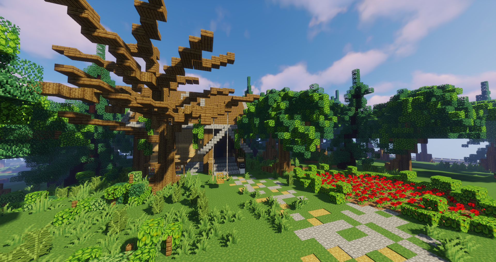
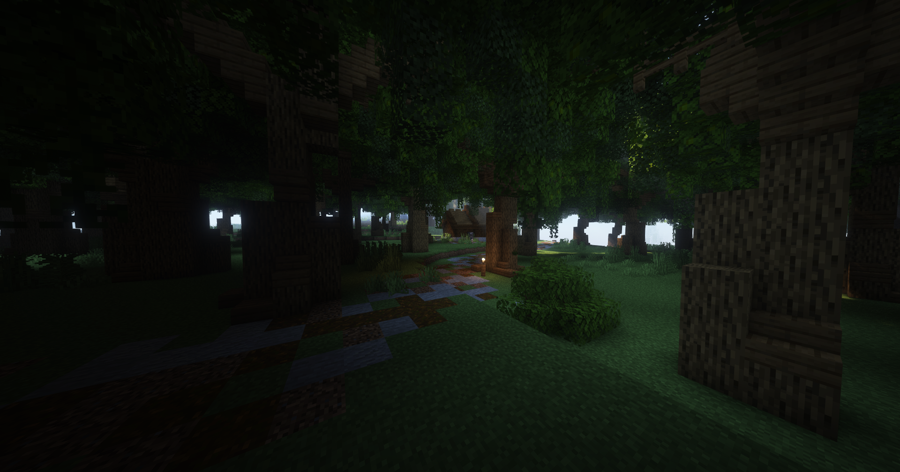

# Jagd

In den Bergen gibt es die Möglichkeit, Wölfe zu jagen. Durch spezielle Wolfsköder werden die Wölfe angelockt, welche mit [Waffen](../../pages/biz/waffenladen.md) erledigt werden müssen. Für das Erlegen von Wölfen können Hundepfeifen, Wolfspelz und Wolfszähne erhalten werden, wovon ein kleiner Teil beim Jäger, in der Jägerhütte, verkauft werden kann. Auch werden sie für die [Quests](../../pages/allgemein/quests.md) benötigt.

## Die Jagdhütte

Die Jagdhütte befindet sich hinter der Mühle an der Farm (**/navi Jagdhütte**). Hier ist die Möglichkeit Köder und ein Jagdmesser zu kaufen oder seine Jagdbeute zu verkaufen.

## Ablauf der Jagd

Es kann nur ausschließlich im Jagdgebiet gejagt werden, welches sich über das Naturschutzgebiet erstreckt. (**/navi Jagdgebiet**). Die Jagd funktioniert mit den folgenden Punkten:

- Gehe zum NPC Jäger und kaufe Wolfsköder. 
- Im Jagdgebiet den Köder mit Rechtsklick in die Luft auslegen
- Nach etwa 3 Sekunden spawnt ein Wolfsrudel. Diese Wölfe müssen nun getötet werden. Wir empfehlen, genügend Abstand zu halten.
- Hat man alle Wölfe getötet, kann der nächste Köder ausgelegen werden.
- Es können vier verschiedene Items im Inventar landen: 
      - Hundepfeifen
      - Wolfspelz
      - Wolfszähne
      - [Wolfpet](../../pages/pets/wolf.md) 
- Am Ende, das Wolfspelz und Wolfszähne beim NPC verkaufen
    - Hundepfeifen, Wolfspelz und Wolfszähne können bei Quests als Zahlung eingesetzt werden.

Diese Items werden unterschiedlich verwertet: 

* Hundepfeifen: Die Hundepfeifen können das Wolfsrudel lähmen.
* Wolfspelz: Kann beim NPC verkauft oder in der Sekte, als Bezahlung eingesetzt werden.
* Wolfszähne: Kann beim NPC verkauft oder in der Sekte, als Bezahlung eingesetzt werden.
* Wolfpet: Kann im [Tierheim](../../pages/gebäude/tierheim.md) verkauft oder ins [Handelshaus](../../pages/gebäude/handelshaus.md) gestellt werden.

### Dropchance beim Töten eines Wolfes

| Item | Dropchance |
|:-:|:-:|
| Knochen | 25% |
| Vergammeltes Fleisch | 50% |

### Verkauf von Jagditems

| Item | Verkaufspreis pro Stück |
|:-:|:-:|
| Wolfszahn | 50.0€ |
| Wolfspelz | 1.20€ |

## Tipps & Tricks

* Schusswaffen sind effektiver als das Jagdmesser.
* Es spawnt ein Alphawolf, welcher stärker ist als alle anderen Wölfe.
* Beim Jagen erhält man [Combat-XP](../../pages/skills/combat.md).
* Es besteht die Chance, das Wolfpet zu erhalten.
* Die Wölfe sind sehr stark. Es braucht Geschick im Umgang mit Waffen und etwas Strategie, um sie zu töten.
