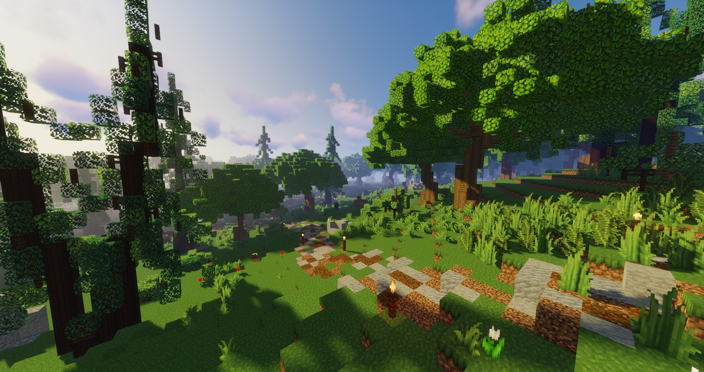

# Jagd

Im Jagdgebiet gibt es die Möglichkeit, Wölfe zu jagen. Durch spezielle Wolfsköder werden die Wölfe angelockt, die mit [Waffen](../../pages/biz/waffenladen.md) oder mit dem Jagdmesser erledigt werden müssen. Für das Erlegen von Wölfen können Hundepfeifen, Wolfspelz und Wolfszähne erhalten werden, von denen ein kleiner Teil beim Jäger in der Jägerhütte verkauft werden kann. Sie werden auch für die [Quests](../../pages/allgemein/quests.md) benötigt.

## Die Jagdhütte

Die Jagdhütte befindet sich hinter der Mühle an der Farm (**/navi Jagdhütte**). Hier besteht die Möglichkeit, Köder und ein Jagdmesser zu kaufen oder die Jagdbeute zu verkaufen.

## Ablauf der Jagd

Es kann ausschließlich im Jagdgebiet gejagt werden, welches sich über das Naturschutzgebiet erstreckt (**/navi Jagdgebiet**). Die Arbeit am Jagen läuft folgendermaßen ab:

- Gehe zum NPC Jäger und kaufe Wolfsköder.
- Im Jagdgebiet den Köder mit Rechtsklick in die Luft auslegen.
- Nach etwa 3 Sekunden spawnt ein Wolfsrudel. Diese Wölfe müssen getötet werden. Es wird empfohlen, genügend Abstand zu halten.
- Hat man alle Wölfe getötet, kann der nächste Köder ausgelegt werden.
- Es können vier verschiedene Items im Inventar landen:
  - Hundepfeifen
  - Wolfspelz
  - Wolfszähne
  - [Wolfpet](../../pages/pets/wolf.md)
- Am Ende können Wolfspelz und Wolfszähne beim NPC verkauft werden.
  - Hundepfeifen, Wolfspelz und Wolfszähne können bei Quests als Zahlung eingesetzt werden.

### Verwertung der Items

* **Hundepfeifen**: Können das Wolfsrudel lähmen.
* **Wolfspelz**: Kann beim NPC verkauft oder in der Sekte als Bezahlung eingesetzt werden.
* **Wolfszähne**: Können beim NPC verkauft oder in der Sekte als Bezahlung eingesetzt werden.
* **Wolfpet**: Kann im [Tierheim](../../pages/gebäude/tierheim.md) verkauft oder ins [Handelshaus](../../pages/gebäude/handelshaus.md) gestellt werden.

### Dropchance beim Töten eines Wolfes

| Item | Dropchance |
|:-:|:-:|
| Vergammeltes Fleisch | 50% |
| Knochen des Alphas | 25 % |
| Wolfspelz | 1-2 (je 50 %) |
| Hundepfeife | 3,6% |
| Wolfszahn | 8% bei Alpha-Wölfe |
| [Pet] [Wolf](../pets/wolf.md) | 0,04 % | 

### Verkauf von Jagditems

| Item | Verkaufspreis pro Stück |
|:-:|:-:|
| Wolfszahn | 70,00€ |
| Vergammeltes Fleisch | 1,80€ |
| Wolfspelz | 1,20€ |
| Knochen des Alphas | 8,00€ |

## Tipps & Tricks

* Schusswaffen sind effektiver als das Jagdmesser.
* Es spawnt ein Alphawolf, der stärker ist als alle anderen Wölfe.
* Beim Jagen erhält man [Combat-XP](../../pages/skills/combat.md).
* Es besteht die Chance, das Wolfpet zu erhalten.
* Die Wölfe sind sehr stark. Es braucht Geschick im Umgang mit Waffen und etwas Strategie, um sie zu töten.
* Hundepfeifen können im Downtown beim [Straßenmusiker](../allgemein/quests.md/#der-goldgroschen) verkauft werden (Verkaufspreis: 3,75€).
