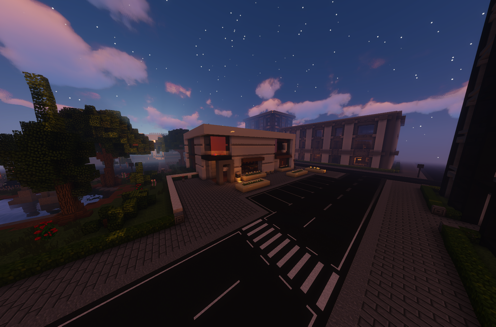

Der Koch ist ein Nebenjob, welcher im Restaurant erledigt werden kann. Für die Kundschaft müssen Sandwiches zubereitet werden.

| <!-- --> | <!-- --> |
| :-: | :-: |
| [Bushaltestelle](../../pages/öpnv/bus.md) | [Polizeipräsidium](../../pages/fraktionen/polizei.md) |
| Navi | /navi Restaurant |
| Dauer | ca. 3 Minuten |
| Cooldown | 7 Minuten |
| Gewinn | Geld, [XP](../../allgmein/level.md), [Koch-XP](../../pages/skills/kochen.md) |

## Aufgaben
1. Sammle alle Zutaten auf mit Rechtsklick.
2. Bereite das Gericht zu der arbeitsplatte zu.
3. Liefere das Gericht mit Rechtsklick an die Theke.
