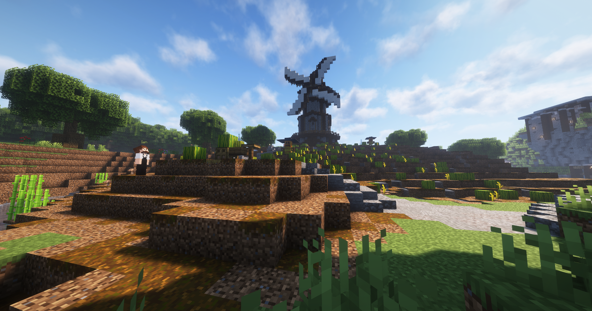

# Melonenspalter

Der Melonenspalter ist ein Nebenjob, der sich vor der Mühle beim [Schwarzmarkt](../../pages/orte/schwarzmarkt.md) befindet. Bei diesem Job ist es das Ziel, Melonen abzubauen.

|  |  |
| :-: | :-: |
| [Bushaltestelle](../../pages/öpnv/bus.md) | Farm |
| [Navi](../../pages/allgemein/navigation.md) | **/navi Farm** |
| Dauer | ca. 5-10 Minuten |
| Gewinn | Geld, [Erfahrungspunkte](../../pages/allgemein/level.md), [Farming-XP](../../pages/skills/farming.md), (XP-Verbesserung) |
| Kosten | 15 Euro pro Axt |

!!! info Kein direkter Navipunkt
    Es gibt keinen direkten Navipunkt zu diesem Nebenjob. Wenn du jedoch **/navi Farm** benutzt, kannst du hinter der Farmer-Hütte die Mühle sehen, bei der sich die Melonen befinden. Dort findest du auch Ian.

## Aufgabe
1. Zu Ian gehen.
2. Äxte kaufen, maximal 5.
3. Mit den Äxten die Melonen abbauen.
4. Melonen bei Ian verkaufen.
5. Wenn du möchtest, kannst du entrindetes Holz an Ian geben, um 5 neue Äxte zu erhalten, und ab Schritt 2 weitermachen.
