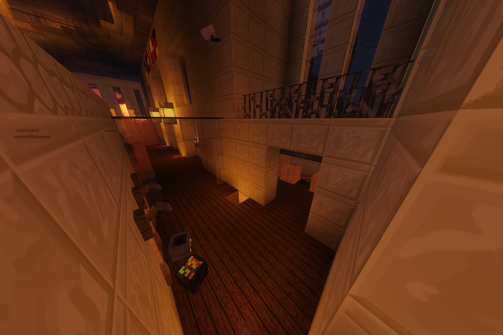

# Straßenreiniger (Nebenjob)
Der Straßenreiniger ist ein Nebenjob, welcher beim [Rathaus](../../pages/​orte/​rathaus.md) gestartet wird. Durch die vielen Besucher verdreckt sich die Straße vor dem Rathaus schneller. Für eine kleine Belohnung kann hier die Straße sauber gemacht werden.

| <!-- --> | <!-- --> |
| :-: | :-: |
| [Bushaltestelle](../../pages/öpnv/bus.md) | Postzentrale |
| [Navi](../../pages/allgemein/navigation.md) | /navi Rathaus |
| Dauer | ca. 1 Minuten |
| Cooldown | 5 Minuten |
| Gewinn | Geld, [Erfahrungspunkte](../../pages/allgemein/level.md), [Sozial-XP](../../pages/skills/social.md) |

## Aufgabe
1. Nehme den Job und Besen mit **/straßenreiniger** unter der rechten Treppe des Rathauses an.
2. Putze mit dem Besen die bemoosten Gehwege vor dem Rathaus.
3. Wiederhole diesen Vorgang, bis der Nebenjob beendet ist.
