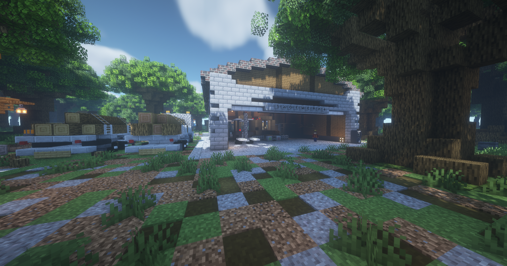

# Sägewerk 

Das Sägewerk (**/navi Saegewerk**) befindet sich nord-östlich von [Downtown](../../pages/gebiete/downtown.md), dessen nächstgelegene [Bushaltestelle](../../pages/öpnv/bus.md) Altersheim ist.
Am Sägewerk kann als Holzfäller gearbeitet werden. Diese Arbeit gewährt einem [Erfahrungspunkte](../../pages/allgemein/level.md), Geld, [Handwerk-XP](../../pages/skills/handwerk.md) und [Sozial-XP](../../pages/skills/social.md). 

## Ablauf

Die Arbeit am Sägewerk funktioniert mit den folgenden Punkten:

*  Gehe zum NPC Jack und kaufe eine Axt. 
*  Nun müssen Bäume in der Umgebung gefällt werden.
*  Es können vier verschiedene Items im Inventar landen: 
      *  Stock 
      *  Holzstamm 
      *  Entrindeter Holzstamm
      *  Baumharz
*  Am Ende die Holzstämme in der Halle bei der Säge verarbeiten und verkaufen
*  Stöcke im Mülleimer entsorgen

## Äxte

| Axt | Preis | Verzauberung | Mindest Skill Level |
| :-: | :-: | :-: | :-: |
| Einfache Eichenaxt | 30€ | Keine | Level 0 |
| Widerstandsfähige Eichenaxt | 40€ | Effizienz 1 | Level 4 |
| Verstärkte Eichenaxt | 50€ | Effizienz 2 | Level 7 |

### Verkauf von Sägewerkitems

| Item | Verkaufspreis pro Stück |
|:-:|:-:|
| Eichenholz | 0.50€ |
| Entrindetes Eichenholz| 2.00€ |

## Hilfreiche Tipps

* Je höher das Handwerk Skill Level ist, desto bessere Fähigkeiten und Chancen können freigeschaltet werden.
* Die Pets [Affe](../../pages/pets/affe.md) und [Biene](../../pages/pets/biene.md) unterstützen die Arbeit am Sägewerk.
* Abgebaute Holzblöcke färben sich braun und regenerieren sich nach kurzer Zeit von selbst.

