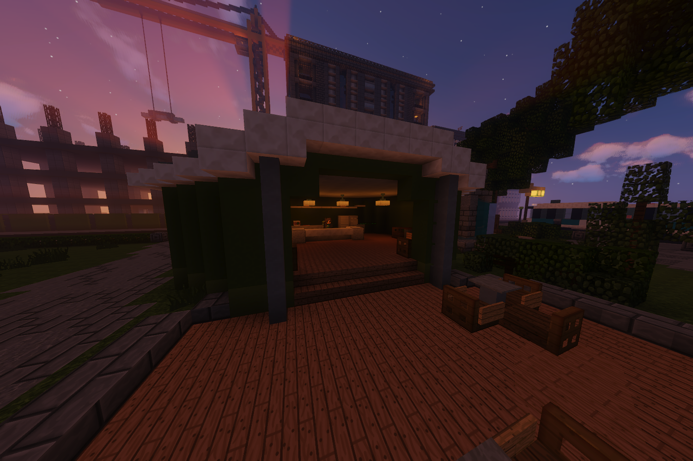

# Tellerwäscher (Nebenjob)
Der Tellerwäscher ist ein Nebenjob, welcher am [Starblocks](../../pages/bit/starblocks.md)-1 gestartet werden kann. Tag ein und aus kommen viele zum Starblock und hinterlassen ihre Tische nicht sauber. 

| <!-- --> | <!-- --> |
| :-: | :-: |
| [Bushaltestelle](../../pages/öpnv/bus.md) | Postzentrale |
| Navi | /navi Starblocks-1 |
| Dauer | ca. 1 Minuten |
| Cooldown | 5 Minuten |
| Gewinn | Geld, [XP](../../pages/allgemein/level.md), [Sozial-XP](../../pages/skills/social.md) |

## Aufgabe
1. Nehme den Job im laden mit **/tellerwäscher** an
2. Reinige verdreckte Tische mit Rechtsklick.
3. Wiederhole diesen Vorgang bis der Nebenjob beendet ist.
