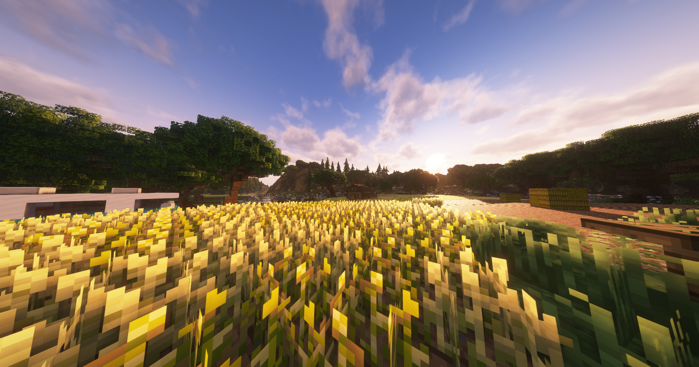

# Weizenfelder

Der Weizenfeld-Job befindet sich auf dem Bauernhof in der Nähe der [Bushaltestelle](../../pages/öpnv/bus.md) **„Farm“**. Hier können Spieler Weizen anbauen, ernten und anschließend verkaufen oder weiterverarbeiten. 

## Weizen abbauen

Auf den Weizenfeldern kannst du mit einer Hacke Weizen ernten. Je nach deinem Farming-Level stehen dir verschiedene Hacken zur Verfügung:

| Hacke | Farming-Level | 
|:-:|:-:|
| Einsteiger-Hacke | Level 2 |
| Anfänger-Hacke | Level 5 |
| Profi-Hacke | Level 20 |
| Experten-Hacke | Level 10 |
| Meister-Hacke | Level 30 |

Die Hacken können beim NPC Anton auf dem Bauernhof gekauft werden.

## Weiterverarbeitung

Der geerntete Weizen kann bei der alten Mühle (**/navi 862 90 -206**) zu Mehl weiterverarbeitet werden. Für die Herstellung eines Mehls werden 16 Weizen benötigt. Das Mehl kann anschließend beim Bäcker im Reichenviertel verkauft werden (**`/navi 139 72 232`**).

## Verkauf von Weizen und Mehl

| Item | Verkaufspreis pro Stück |
|:-:|:-:|
| Weizen | 0,12 € |
| Mehl | 3,30 € |

## Hilfreiche Tipps

* Nutze den Befehl **`/navi Bauernhof`**, um schnell zu den Weizenfeldern zu gelangen.
* Je höher dein Farming-Level ist, desto bessere Hacken kannst du nutzen, um effizienter zu arbeiten.
* Der Verkauf von Mehl bringt mehr Gewinn als der direkte Verkauf von Weizen – die Weiterverarbeitung lohnt sich!
