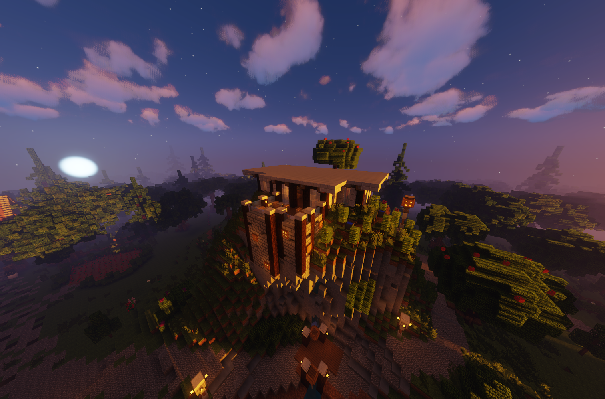

# Winzer (Nebenjob)

Der Winzer ist ein Nebenjob, welcher sich am Weinberg befindet. Die Weinreben wachsen sehr gut an in Vance City. Etwas Geld kann sich hier mit Weintrauben pflücken erarbeitet werden.
(**/navi Winzer**) 

| [Bushaltestelle](../../pages/öpnv/bus.md) | Farm |
| :-: | :-: |
| [Navi](../../pages/allgemein/navigation.md) | /navi Weinberg |
| Dauer | ca. 2 Minuten |
| Cooldown | 5 Minuten |
| Gewinn | Geld, [Erfahrungspunkte](../../pages/allgemein/level.md), [Farming-XP](../../pages/skills/farming.md) |

## Aufgabe
1. Mit **/winzer** wird der Nebenjob gestartet.
2. Vor dem Gebäude befinden sich viele Weinreben mit Trauben (violette Köpfe).
3. Diese müssen nun alle mit Rechtsklick abgeerntet werden.
4. Wiederhole diesen Vorgang, bis der Nebenjob beendet ist.
