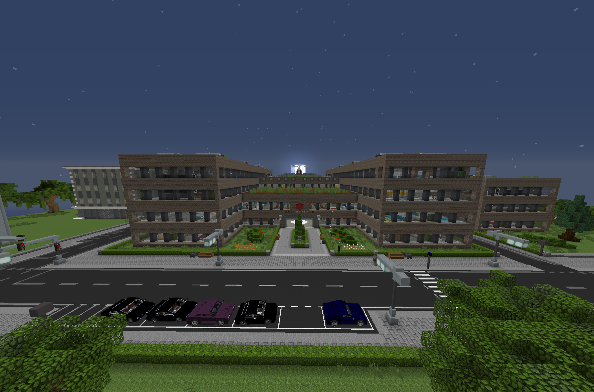

# Wäschetransport (Nebenjob)
Der Wäschetransport ist ein Nebenjob, welcher im Uniklinikum angenommen wird. 

| <!-- --> | <!-- --> |
| :-: | :-: |
| Bushaltestelle | Uniklinik |
| Navi | /navi Uniklinik |
| Dauer | ca. 5 Minuten |
| Cooldown | 6 Minuten |
| Gewinn | Geld, XP, [Farming-XP](../../pages/skills/farming.md) |

## Aufgabe
Liefere die Wäsche zur Wäscherei.
