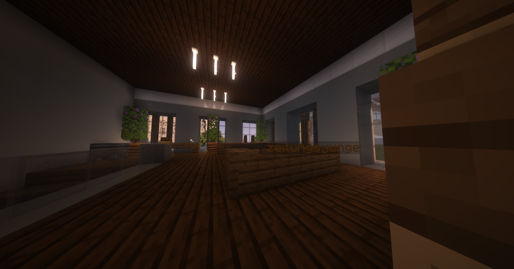

# Zeitungsjunge (Nebenjob)
Der Zeitungsjunge ist ein Nebenjob, welcher bei der [Presseagentur](../../pages/fraktionen/presse.md) angenommen werden kann.

| <!-- --> | <!-- --> |
| :-: | :-: |
| [Bushaltestelle](../../pages/öpnv/bus.md) | Altenheim |
| [Navi](../../pages/allgemein/navigation.md) | /navi Presseagentur |
| Dauer | ca. 7 Minuten |
| Cooldown | 6 Minuten |
| Gewinn | Geld, [Erfahrungspunkte](../../pages/allgemein/level.md), [Farming-XP](../../pages/skills/farming.md) |

## Aufgabe
1. In der 2. Etage der Presseagentur den Nebenjob mit **/zeitungsjunge** annehmen.
2. Zu Wohnhäusern und Wohnungen hingehen.
3. Rechtsklick auf das Hausschild.
4. Die Zeitung abgeben.
5. Vorgang an anderen Hausschildern wiederholen, bis der Nebenjob beendet ist.
