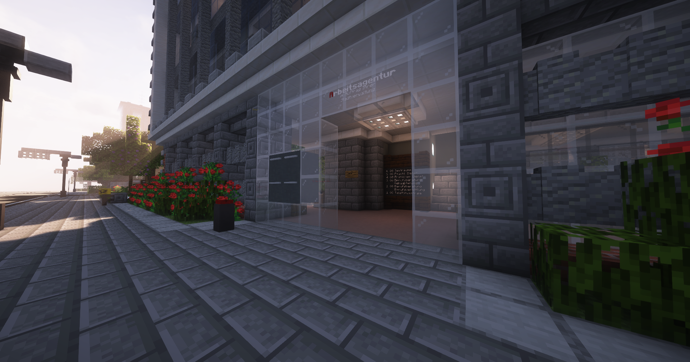

# Arbeitsagentur
Die Arbeitsagentur kann dir momentan 3 verschiedene Jobs anbieten. Wenn du diese Jobs erledigst, verdienst du pro Auftrag/Tätigkeit.

Folgende Jobs sind momentan verfügbar:

<li>Mechaniker
<li>Bestatter
<li>Schlüsseldienst </li>

Bei der Arbeitsagentur angekommen, musst zum NPC "Arbeitsagentur" hingehen. 

Nachdem du dich für ein Beruf ausgesucht hast, musst du beim Mechaniker und beim Schlüsseldienst dir dein Werkzeug abholen, diesen kannst du dir abholen dort wo deren Büro Ort ist. Diesen Ort findest du nach dem Berufannahme beim Kompass.
