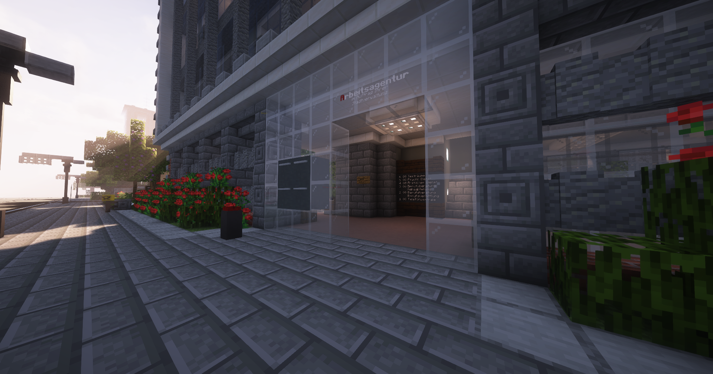

# Arbeitsagentur

Die Arbeitsagentur kann dir momentan drei verschiedene Jobs anbieten. Wenn du diese Jobs erledigst, verdienst du Geld pro Auftrag oder Tätigkeit.

Bei der Arbeitsagentur angekommen, musst du zum NPC „Arbeitsagentur“ gehen.  
Das „Büro“ der einzelnen Berufe findest du, indem du mit dem Kompass navigierst.

# Verfügbare Berufe
## Mechaniker
Mit dem Mechaniker-Beruf kannst du Autos reparieren. Um Autos zu reparieren, brauchst du ein Werkzeug, das bei der [KFZ-Werkstatt](../fahrzeuge/kfz-werkstatt.md) beim NPC am Tresen erhältlich ist.  
Die Autos, die repariert werden müssen, müssen vom Spieler als Auftrag angefordert werden. Um alle Aufträge zu sehen, brauchst du ein Handy und kannst oben auf "Aufträge" klicken, um alle aktiven Aufträge zu sehen.  
Bei einem Auto angekommen, musst du ++shift+rbutton++ drücken. Dann wird eine Prozentzahl hochgezählt, bis sie 100 erreicht.

## Bestatter
Beim Bestatter bekommst du Aufträge, wenn eine bewusstlose Person verstorben ist. Die Leichen müssen abgeholt und zum Bestatterinstitut (**/navi Bestatter**) gebracht werden. Dort wird die Leiche gereinigt und anschließend auf dem nahegelegenen Friedhof bestattet.

!!! info "Hinweis"
    Es kann nur eine Leiche transportiert werden.

|Befehl|Funktion|
|:-:|:-:|
| /pickupbody | Die Leiche aufsammeln. |
| /cleanbody | Die Leiche reinigen. |
| /dropbody | Die Leiche bestatten. |

## Schlüsseldienst
Beim Schlüsseldienst musst du dich auf die Suche nach offenen Haustüren machen. Diese Häuser müssen allerdings einen Besitzer haben. Das Werkzeug bekommst du vom Schlüsseldienst.  
Die Türen, die geschlossen werden müssen, kannst du mit ++rbutton++ anklicken, damit sie sich schließen.

!!! info "Navi Schlüsseldienst"
    Es gibt keinen direkten Navipunkt zum Schlüsseldienst. Um herauszufinden, wo sich dieser befindet, musst du in die Arbeitsagentur gehen und beim NPC auf "Kompass" klicken.

## Belohnung für das Ausführen eines Berufes
Sobald du einen Auftrag oder eine Tätigkeit erledigt hast, musst du warten, bis du deinen [Payday](../allgemein/payday.md) erhältst.  
Nach Erhalt des Paydays wird das Geld von deiner Tätigkeit oder deinem Auftrag auf dein Bankkonto überwiesen.
