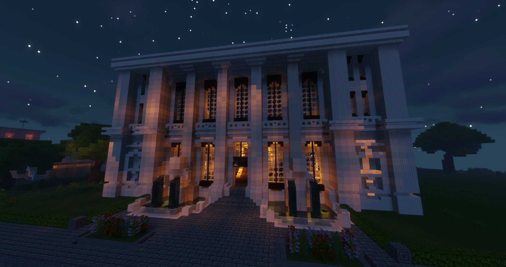

# Banken

 

Neben der Zentralbank, die sich in [Downtown](../../pages/gebiete/downtown.md) befindet und gut über die [Bushaltestelle](../../pages/öpnv/bus.md) Altersheim erreichbar ist, gibt es zahlreiche kleinere Bankfilialen im gesamten Stadtgebiet. In den Banken werden die Spieler mit den nötigen Items ausgerüstet, um die persönliche finanzielle Lage auf dem Server zu verwalten.

## Bankkarte 

Am Schalter der Bank kann mit Rechtsklick auf den NPC Bianca das Konto verwaltet werden. Dort bekommt man auch seine Bankkarte, welche später für das Abheben und Einzahlen von Bargeld benötigt wird. Hat man seine Bankkarte verloren, kann diese bei einer Bank gesperrt werden und neu beantragt werden.

!!! warning "Bankkarte"
    Bankkarten können fallen gelassen werden und von anderen Spielern aufgesammelt werden, welche dann auf das Konto zugreifen können.

## Kontenverwaltung 

Es können neben dem eigenen Standardkonto weitere Konten wie z.B. Gewerbekonten, Fraktionskonten und Zusatzkonten erstellt bzw. verwaltet werden.
Zu jedem [PayDay](../../pages/allgemein/payday.md) werden Einkünfte, Steuern, Abgaben, etc. mit dem Standardkonto verrechnet.

## Kreditsystem

Bei NPC Bianca kannst du Kredite verwalten. Dort hast du die Möglichkeit:

* Kredite zu vergeben
* vergebene oder erhaltene Kredite einzusehen

Um einen Kredit zu bekommen, brauchst du einen anderen Spieler, der dir diesen vergibt.
Möchtest du selbst einen Kredit vergeben, muss der Spieler in deiner Nähe sein.

Du bestimmst dabei ganz flexibel:
* die Summe
* die Laufzeit
* die Zinsen

## Geldautomaten (ATM)

Geldautomaten sind auf der ganzen Map verteilt. Besonders oft zu finden sind diese bei Bushaltestellen und öffentlichen Gebäuden. Sie erlauben es beispielsweise dem Spieler seinen Kontostand einzusehen und Geld von diesem abzuheben oder einzuzahlen.

### Geld abheben 

* Bankkarte in die Hand nehmen und Rechtsklick auf einen Geldautomaten machen.
* Das Feld "Geld abheben" auswählen.
* Den gewünschten Betrag eingeben.

### Geld einzahlen

* Bankkarte in die Hand nehmen und Rechtsklick auf einen Geldautomaten machen.
* Das Feld "Geld einzahlen" auswählen.
* Den gewünschten Betrag eingeben.

### Kontoauszug 

* Bankkarte in die Hand nehmen und Rechtsklick auf einen Geldautomaten machen.
* Das Feld "Kontoauszug" auswählen. 
* Es erscheint eine Übersicht der letzten Transaktionen (gewöhnlich seit dem letzten Server-Neustart) im Chat. 

### Geld überweisen

* Man stellt sich an einen ATM.
* Nun gibt man den Befehl **/überweisen [Name][Betrag][Verwendungszweck]** ein.
* Das Geld wird umgehend überwiesen, allerdings werden Gebühren verrechnet.
      * Beispiel: /überweisen KleinWunder 1720 Rückzahlung
  
### ATM aufbrechen
Bankautomaten können mit einer [Brechstange](../../pages/items/brechstange.md) aufgebrochen werden um Schwarzgeld erlangen.
