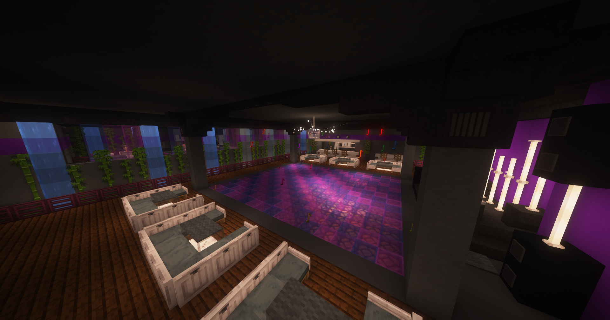

# Disco

Die Disco ist der perfekte Ort, um mit Freunden zu feiern, zu tanzen und die Nacht zu genießen. Mit einer großen Tanzfläche, einer beeindruckenden Lichtshow und einem DJ, der die besten Tracks auflegt, bietet die Disco ein unvergessliches Erlebnis. Der Eintritt ist kostenlos, und die Disco ist über die [Haltestelle](../../pages/öpnv/bus.md) Justizvollzugsanstalt leicht zu erreichen.

## Musik
Der DJ legt eine Mischung aus verschiedenen Musikrichtungen auf, sodass für jeden etwas dabei ist. Es gibt auch die Möglichkeit, über den Befehl **/disco skip** einen Song zu überspringen

## Tanzfläche
Die Tanzfläche ist das Herzstück der Disco. Hier können Spieler ihre Tanzfähigkeiten zeigen und mit anderen interagieren.

Die Disco ist der ideale Ort, um nach einem langen Tag in der Stadt zu entspannen und Spaß zu haben. Viel Spaß beim Feiern!