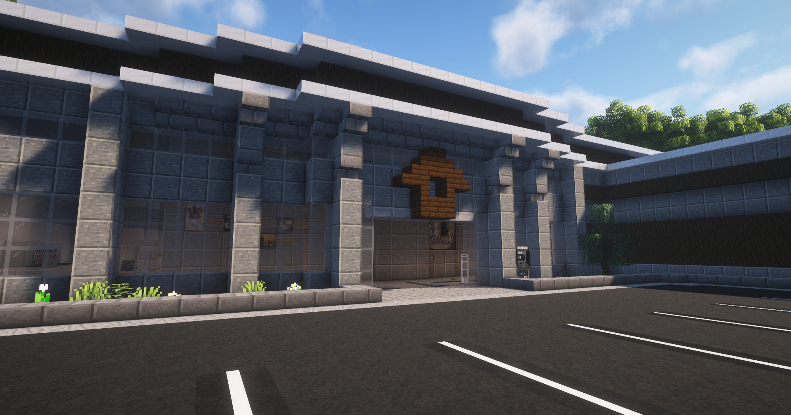

# Möbelhaus

  

Das Möbelhaus ist da, um Verbesserungen für sein Haus zu kaufen. Ebenso kann dort Endprodukte des [Bergwerks](../../pages/nebenjobs/bergbau.md) und [Sägewerk](../../pages/nebenjobs/sägewerk.md) verkauft werden.

## Hausverbesserungen
Es ist möglich, verschiedene Upgrades an seinem Haus vorzunehmen.

| Verbesserung | Kosten |
|:-:|:-:|
| Hauskasse | 3.000,00€ |
| Waffenschrank | 2.800,00€ |
| Mieterslots | Grundpreis und Mieter abhängig |
| Hauslager | 4.500,00€ |
| Hauslager upgraden | Varriiert mit steigender Kapazität |

## Endprodukte verkaufen
Im Lager des Möbelhauses ist es möglich, sein poliertes Eisen und Holzbretter zu verkaufen. (**/dropiron** **/dropholz**)
