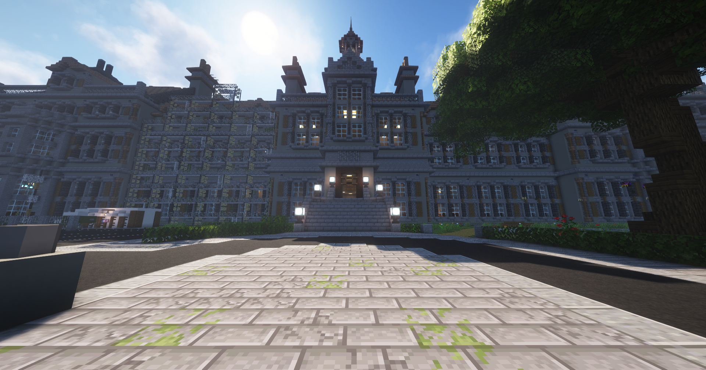

# Psychiatrie
 
Die Psychiatrie, die sich in der [Altstadt](../../pages/gebiete/altstadt.md) befindet, ist ein nicht öffentlicher Ort, den Psychopathen besuchen können, wenn sie von einem Mediziner eingewiesen werden. 

Die Psychiatrie hilft dir, wieder psychisch gesund zu werden.

## Wie kommt man in die Psychiatrie?
Um in die Psychiatrie zu gelangen, muss man eine Gefahr für sich selbst oder andere darstellen. Dazu wird man von einem Mediziner fachgerecht eingewiesen. Beispiele für einen Besuch in der Psychiatrie sind manipulative Verhaltensweisen gegenüber anderen Bewohnern, mangelnde Empathie oder Aggressivität.

!!!info Anforderungen
   Man kann nur in die Psychiatrie eingewiesen werden, wenn man den Status "Psychopath" bei **/health** hat.

### Wie kommt man heraus?
Die Psychiatrie ist ein gesperrter Bereich, sodass ein Zivilist weder in das Gebäude hinein- noch hinauskommt. Wenn du in die Psychiatrie eingewiesen wurdest, musst du im Hinterhof im Hasengehege 35 Hasen anklicken.     Diese Hasen spawnen direkt um das Hasengehege herum. Nachdem du alle 35 Hasen angeklickt hast, wirst du automatisch vor die Psychiatrie teleportiert und kannst wieder frei herumlaufen.
