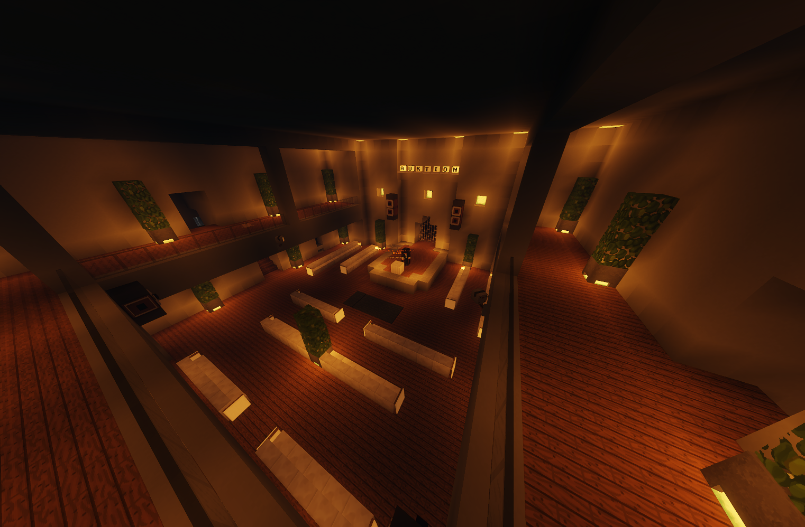

# Schwarzmarkt

Der Schwarzmarkt befindet sich unter einer Mühle. Hier kann man Items kaufen, die im normalen Spielgeschehen nicht erhältlich sind.

|  |  |
| :-: | :-: |
| Nächste Bushaltestelle | Farm |
| Ort | /navi Schwarzmarkt |
| Eintrittskosten | 200€ |

Um dir Eintritt zu verschaffen, musst du zuerst zu Simon gehen, der sich links neben der Mühle befindet.

## Verkaufte Items
Hier können verschiedene Items gekauft werden, die zufällig in die Auktion aufgenommen werden.

| Gegenstand | Anfangspreis |
| :-: | :-: |
| [Hase](../../pages/pets/hase.md) | 1850 Euro |
| [Fledermaus](../../pages/pets/fledermaus.md) | / |
| Messer | / |
| [Brechstange](../../pages/items/brechstange.md) | / |
| [Heilkrautsamen](../pflanzen/heilkraut.md) | 90 Euro |
| Tablettenschachtel | 950 Euro |
| [Havok-47](../../pages/items/weapons/sturmgewehre.md) | 900 Euro |
| Schildcracker | / |
| [Dietrich](../../pages/items/dietrich.md) | / |
| Perk: Erweiterte Tasche | / |
| [Petupgrade](../../pages/pets/allgemein.md) | / |
| Fischer-Rucksack | / |
| Jäger-Rucksack | / |
| Petupgrade Item | / |

