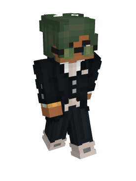
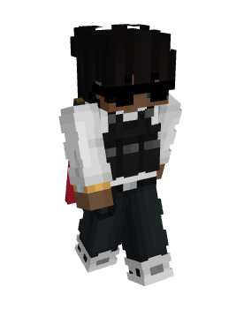
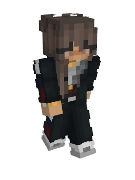
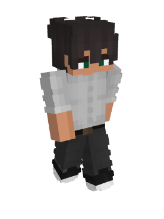

  

<b> Wiki-Teamleitung </b>  

  

<b> Wiki Team </b>  
 
 
  
 
  

 

### Informationen 

Hallo!

Wir sind das Wikiteam. Unsere Hauptaufgabe ist es, jede Seite, die du hier im Wiki findest, auf dem aktuellsten Stand zu halten. Wir arbeiten oft mit dem Entwicklerteam zusammen, um für euch Informationen aus erster Hand zu bekommen und diese rechtzeitig aktualisieren zu können, damit sich Neulinge sowie auch alte Hasen immer bestens auf dem Server auskennen. Seien es Informationen über die aktuellen Möglichkeiten Skill-XP, die verschiedenen Nebenjobs oder auch über die Fahrzeuge, die wir auf GermanRP anbieten dürfen. Hier, im Wiki, findest du wahrscheinlich viele Antworten auf Fragen, die dir so im Kopf herumschwirren. Blätter dich doch einfach mal durch die einzelnen Seiten und überzeug dich selbst von den umfassenden Beiträgen!

Aufgrund der Tatsache, dass es bei uns ständig was zu tun gibt, suchen wir auch tatkräftig nach helfenden Händen in unseren Reihen, die eben motiviert und engagiert sind und die Community auf dem neuesten Stand halten möchte. Wenn du Interesse hast, kannst du ja gerne einmal in unserem [Bewerbungsforum](https://germanrp.eu/forum/index.php?board/200-bewerben/) vorbeischauen. Wir freuen uns auf dich! 

 Mehr über uns kannst du auch im Forum finden. ([Klicke hier](https://germanrp.eu/forum/index.php?thread/12284-vorstellung-des-wiki-teams/))
