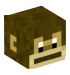

# Affe

Wie auch nicht anders zu erwarten hängt so ein Affe gerne in den Bäumen rum. Von dort kannst du ihn nämlich auch erhalten: durch das Fällen von Bäumen beim Sägewerk. Er gilt neben der Biene als effektivster Booster des **Farming** Skill-XP.  

## Die verschiedenen Stufen des Affen
| Stufe | Langfinger | Effizenz | Affenstark |
|:-:|:-:|:-:|:-:|
| Gewöhnlich | Erhalte 20% mehr [Farming-XP](../../pages/skills/farming.md) |
| Ungewöhnlich | Erhalte 40% mehr Farming-XP |
| Selten | Erhalte 50% mehr Farming-XP |
| Episch | Erhalte 60% mehr Farming-XP | Deine [Axt](https://github.com/ImGxrke/GRWiki/blob/master/docs/pages/nebenjobs/sägewerk.md#äxte) verliert mit einer 5% Chance keine Haltbarkeit beim Abbauen. |
| Legendär | Erhalte 70% mehr Farming-XP | Deine Axt verliert mit einer 10% Chance keine Haltbarkeit beim Abbauen. |
| Ultralegendär | Erhalte 80% mehr Farming-XP | Deine Axt verliert mit einer 15% Chance keine Haltbarkeit beim Abbauen. | Dein Pet baut zusätzlich mit einer 5% Chance einen weiteren Holzstamm ab. |
