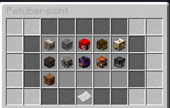

## Allgemein

Auf GermanRP ist eine Vielzahl von Pets erhältlich.
Die Pets bringen dem Spieler gewisse Vorteile in bestimmten Situationen.
Sie agieren in Verbindung mit den [Skills](../../pages/skills/allgemein.md) des Spielers. 
Jedes Pet hat seine eigenen Fähigkeiten und kann um mehrere Stufen im Tierheim verbessert werden.

## Tierarten

Zur Zeit gibt es 11 verschiedene Pets.
Jedes Pet ist einem bestimmten Skill zugeordnet.
 Manche Pets teilen sich einen Skill.  

 - [Katze](katze.md) ([Social-Skill](../../pages/skills/social.md))
 - [Hund](hund.md) ([Combat-Skill](../../pages/skills/combat.md))
 - [Affe](affe.md) ([Farming-Skill](../../pages/skills/farming.md))
 - [Papagei](papagei.md) ([Fischer-Skill](../../pages/skills/fischer.md))
 - [Rentier](rentier.md) ([Koch-Skill](../../pages/skills/kochen.md))
 - [Wolf](wolf.md) ([Combat-Skill](../../pages/skills/combat.md))
 - [Schmetterling](schmetterling.md) ([Gärtner-Skill](../../pages/skills/gärtner.md))
 - [Fledermaus](fledermaus.md) ([Bergbau-Skill](../../pages/skills/bergbau.md))
 - [Hase](hase.md) ([Gärtner-Skill](../../pages/skills/gärtner.md))
 - [Biene](biene.md) ([Farming-Skill](../../pages/skills/farming.md))
 - [Capybara](capybara.md) ([Fischer-Skill](../../pages/skills/fischer.md))

## Pets verbessern

 Um dein Pet zu verbessern musst du dich einmal auf den Weg zum Tierheim machen.
 Dort kannst du dann mit Kate sprechen und dein Pet von **Gewöhnlich** auf maximal **Selten** verbessern.
 Solltest du dein Pet weiter verbessern wollen, musst du dir ein Petupgrade besorgen.
 Damit kannst du dann zu Dorothea gehen und dein Pet von Selten auf Episch verbessern.
 Diesen Vorgang kannst du öfters wiederholen bis du ein Ultralegendäres Pet hast. 
 
 
 

## Eier

Von Gewöhnlich bis Legendär hast du die Möglichkeit, durch Jobrotations oder die Kiste des Capybaras, Peteier zu bekommen. Öffnest du diese, hast du die Chance eines von fünf Pets zu erhalten. ([Papagei](papagei.md), [Katze](katze.md), [Hase](hase.md), [Hund](hund.md) oder [Capybara](capybara.md))
