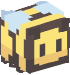

# Biene

Die Biene hält sich gerne in der Nähe vom [Sägewerk](/../../pages/nebenjobs/sägewerk.md) bei den Pflanzen auf. Irgendwann traut sich eine Biene zu einem Spieler zu fliegen. So bekommt man auch die Bienen während des Holz fällen und verhilft einem zur mehr Haltbarkeit an der Axt.

## Die verschiedenen Stufen der Biene
| Stufe | Eleganter Umgang | Teamarbeit | Bienenstark |
|:-:|:-:|:-:|:-:|
| Gewöhnlich | Deine [Axt](https://github.com/ImGxrke/GRWiki/blob/master/docs/pages/nebenjobs/sägewerk.md#äxte) verliert mit einer 5% Chance keine Haltbarkeit beim Abbauen. |
| Ungewöhnlich | Deine Axt verliert mit einer 10% Chance keine Haltbarkeit beim Abbauen. |
| Selten | Deine Axt verliert mit einer 15% Chance keine Haltbarkeit beim Abbauen. |
| Episch | Deine Axt verliert mit einer 20% Chance keine Haltbarkeit beim Abbauen. | Erhöht die Chance auf Farmingfunde um 5% bei aktivem Pet. |
| Legendär | Deine Axt verliert mit einer 25% Chance keine Haltbarkeit beim Abbauen. | Erhöht die Chance auf Farmingfunde um 10% bei aktivem Pet. |
| Ultralegendär | Deine Axt verliert mit einer 30% Chance keine Haltbarkeit beim Abbauen. | Erhöht die Chance auf Farmingfunde um 15% bei aktivem Pet. | Erhalte 45% mehr [Farming-XP](../../pages/skills/farming.md). |
