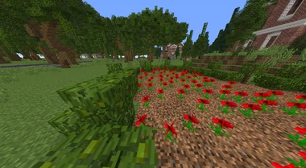
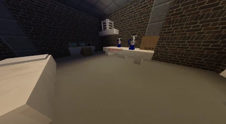

# Mohnfeld

Mohnfelder dienen dazu, um Mohn zu gewinnen. Das Mohn ist die Voraussetzung, um im Labor Mohnextrakt herzustellen, welches dann zu [Mohnkapseln](../../pages/bmt/mohnkapsel.md) verarbeitet wird. Die Crimefraktionen [Yakuza](../../pages/fraktionen/yakuza.md), [Camorra](../../pages/fraktionen/camorra.md) und [The Establishment](../../pages/fraktionen/establishment.md) haben die Möglichkeit Mohnextrakt herzustellen.

## Mohnabbau
Um Mohn zu gewinnen, baut man den Block unter dem Mohn auf dem Mohnfeld ab. Nach Abbau eines Blockes erhält man zwischen 0.30 und 1.30 [Gärtner Skill-XP](../../pages/skills/gärtner.md) und 7 bis 8 Mohn. 

## Lage der Mohnfelder
Die Mohnfelder befinden sich gegenüber des [Camorra Hauptquartier](../../pages/fraktionen/camorra.md) im [Reichenviertel](../../pages/gebiete/reichenviertel.md), am Rande des [Asiaviertels](../../pages/gebiete/asiaviertel.md), bei der [Jagdhütte](../../pages/nebenjobs/jagd.md) in der Farm und in [Westside](../../pages/gebiete/westside.md) nahe der [Tankstelle-5](../../pages/biz/tankstelle.md).

## Mohnextrakt
Um Mohnextrakt zu erhalten, wird das geerntete Mohn verarbeitet. Für ein Mohnextrakt benötigt man 1000 Mohn. Das Mohnextrakt kann im Labor mit dem Befehl **/drymohn** hergestellt werden. 
