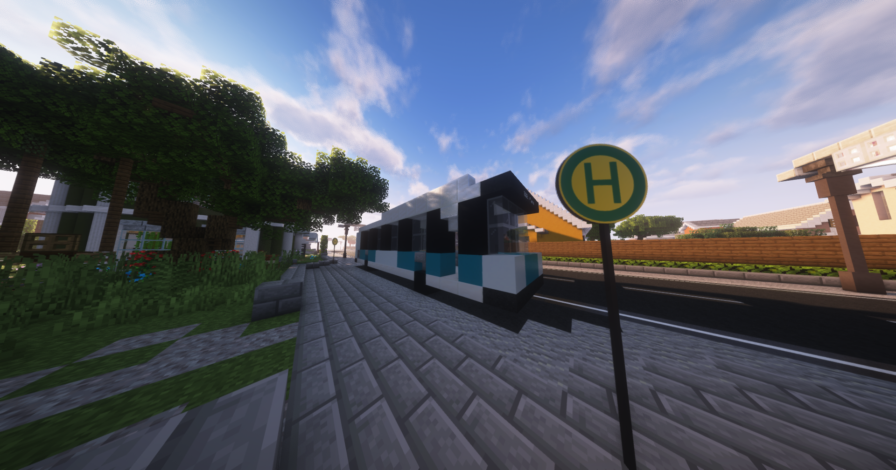

# Bus
Der Bus ist einer der Verkehrsmittel, welches einen schnell von A nach B bringen kann. Die Fahrtzeit kann durch Drücken der ++shift++ + ++f++ Taste eingesehen werden. Um mit dem Bus zu fahren, geht man in den Bus und drückt Rechtsklick auf den Busfahrer. Dann kann das gewünschte Reiseziel ausgewählt werden. 

!!! info Während der Busfahrt
    In einem Bus wird kein RP gemacht, auch kann im Bus kein Spieler Schaden erhalten und verteilen.

## Lage der Busse
Die Busse befinden sich meist an wichtigen Punkten auf der Map (z.B. am Krankenhaus, in der Nähe des Rathauses usw.). Mit **/navi** → Orte in der Nähe sieht man die Bushaltestelle, zu der die geringste Entfernung besteht.

## Preis und Aussehen
Der Preis von einer Busfahrt variiert zwischen 2.75€ - 6.75€. Die Kosten werden durch die Distanz zwischen den Bushaltestellen bestimmt.
Der Bus hat eine weiß-hellblaue Lackierung. Er steht meistens in einer Haltebucht, wo nebendran ein Haltestellenschild zu sehen ist.

## Haltestellen

| Haltestelle | Gewerbe | [Nebenjobs](../../pages/nebenjobs/nebenjobs.md) | Orte von Interresse|
| :-: | :-: | :-: | :-: |
| Farm | Supermarkt-4   Bar-1   Starblocks-2 | [Farmer](../nebenjobs/farmer.md)   [Getränketransport](../nebenjobs/getränketransport.md)   [Winzer](../nebenjobs/winzer.md)   [Gärtner](../nebenjobs/gärtner.md)   [Blumentransport](../nebenjobs/blumentransport.md) | [Schwarzmarktauktion](../../pages/orte/schwarzmarkt.md)   Gärtnerei   [Mohnfeld](../../pages/pflanzen/mohnfeld.md) |
| Postzentrale | Starblocks-1   Apotheke-1   Bar-3 | [Tellerwäscher](../nebenjobs/tellerwäscher.md)   [Paketsortierer](../nebenjobs/paketsortierer.md) | [Elektroladen](../../pages/allgemein/handy.md)   Blumenladen   [Rathaus](../../pages/orte/rathaus.md)   [Feuerwehr](../../pages/fraktionen/rettungsdienst.md) |
| Uniklinik | Tankstelle-1 | [Wäschetransport](../nebenjobs/wäschetransport.md) | Krankenhaus   [Anglerteich](../../pages/nebenjobs/angler.md)   [Bergwerk](../../pages/nebenjobs/bergbau.md) |
| [Altstadt](../gebiete/altstadt.md) | Apotheke-2   Supermarkt-5   Waffenladen-3   Tankstelle-3   Starblocks-5 |  | Marktplatz   Kirche   [Rousseau HQ](../fraktionen/rousseaufamilie.md)   Psychatrie |
| [Auheim](../../pages/gebiete/auheim.md) | Apotheke-6 | [Munitionstransport](../nebenjobs/munitionstransport.md)   [Erztransport](../nebenjobs/erztransport.md) |   [Tierheim](../../pages/gebäude/tierheim.md) |
| Auheim Nord | Apotheke-6   Waffenladen-5   Supermarkt-8 | [Munitionstransport](../nebenjobs/munitionstransport.md)   [Erztransport](../nebenjobs/erztransport.md) | Papierfabrik   Geldwäsche   Lagerhallen   [Volkov HQ](../fraktionen/volkovfamilie.md) |
| [Strandpassage](../../pages/gebiete/strandpassage.md) | Starblocks-2 |  | Yachthafen |
| [Reichenviertel](../../pages/gebiete/reichenviertel.md) | Supermarkt-2   Apotheke-3 | [Pizzabäcker](../nebenjobs/pizzabäcker.md) | [Sägewerk](../../pages/nebenjobs/sägewerk.md)   [Camorra HQ](../../pages/fraktionen/camorra.md)   Mohnfeld   [Polizei Süd](../../pages/fraktionen/polizei.md) |
| [County](../../pages/gebiete/county.md) | Waffenladen-2   Bar-2   Starblocks-3   Supermarkt-3 | | Tacoladen   Flugplatz |
| Plaza | Supermarkt-3   Tankstelle-2 | [Agavenfarmer](../nebenjobs/agavenfarmer.md) | [Kartell HQ](../../pages/fraktionen/kartell.md) |
| Justizvollzugsanstalt | Tankstelle-3 | [JVA-Transport](../nebenjobs/jvatransport.md)   [Fensterputzer](../nebenjobs/fensterputzer.md) | [Gefängnis](../../pages/orte/jva.md)   Geldwäsche   Möbelhaus |
| [Asia-Viertel](../../pages/gebiete/asiaviertel.md) | Supermarkt-6   Waffenladen-4   Tankstelle-4   Apotheke-4 |  | [Yakuza HQ](../../pages/fraktionen/yakuza.md)   Freizeitpark   Mohnfeld   Meditationstempel |
| [Oststadt](../../pages/gebiete/oststadt.md) | Supermarkt-1   Waffenladen-1 |  | [Jagdgebiet](../../pages/nebenjobs/jagd.md) |
| [Westside](../../pages/gebiete/westside.md) | Supermarkt-7   Tankstelle-5   Apotheke-5 |  | Polizeirevier West   Krankenhaus West |
| Altersheim | Supermarkt-4 | [Zeitungsjunge](../../pages/nebenjobs/zeitungsjunge.md)   [Bademeister](../../pages/nebenjobs/bademeister.md)   [Wäscherei](../nebenjobs/wäscherei.md)   [Koch](../nebenjobs/koch.md) | Presseagentur   Hallenbad   Arztpraxis   Zentralbank |
