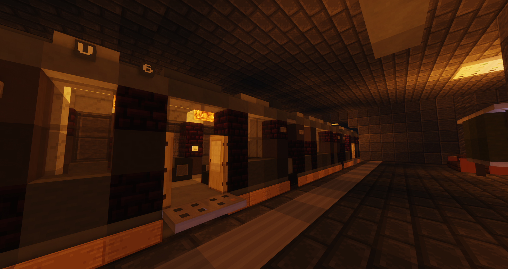

# U-Bahn

Die U-Bahn ist einer der Verkehrsmittel, welches einen schnell von A nach B bringen kann. Die Fahrtzeit kann durch Drücken der ++shift++ + ++f++ Taste eingesehen werden. Um mit der U-Bahn zu fahren, geht man in die Bahn und drückt Rechtsklick den Kopf an der Wand, welches einen Fahrkartenautomaten darstellt. Dann kann das gewünschte Reiseziel ausgewählt werden.

!!! info Während der Bahnfahrt
    In einer Bahn wird kein RP gemacht, auch kann in der Bahn kein Spieler Schaden erhalten und verteilen.

## Lage der U-Bahnstationen

Die Stationen befinden sich meist in wichtigen Stadtteilen auf der Map (z.B. Downtown, Reichenviertel usw.).

## Preis und Aussehen
Der Preis von einer Bahnfahrt variiert zwischen 2.75€, 4.50€ und 6.75€. Die Kosten werden durch die Distanz zwischen den U-Bahnstationen bestimmt.
U-Bahnstationen sind an einem Eingang, welcher mit "U-Bahn" beschriftet ist, zu erkennen. Es führt eine große Treppe runter zum Gleis, wo sich eine Bahn befindet.

## Haltestellen

| Haltestelle | Gewerbe | [Nebenjobs](../../pages/nebenjobs/nebenjobs.md) | Orte von Interresse|
| :-: | :-: | :-: | :-: |
| [Downtown](../../pages/gebiete/downtown.md) | [Apotheke-1](../../pages/biz/apotheke.md)   [Bar-3](../../pages/biz/bar.md) | Tellerwäscher   Paketsortierer   Zeitungsjunge | [Elektroladen](../../pages/allgemein/handy.md)   Blumenladen   [Rathaus](../../pages/orte/rathaus.md)   [Stadthalle](../../pages/orte/stadthalle.md)   [Feuerwehr](../../pages/fraktionen/rettungsdienst.md) |
| [Ganggebiet](../../pages/gebiete/ganggebiet.md) | Apotheke-2   [Supermarkt-5](../../pages/biz/supermarkt.md)   [Waffenladen-3](../../pages/biz/waffenladen.md) |  | Sekte   [Tierheim](../../pages/gebäude/tierheim.md) |
| [Strandpassage](../../pages/gebiete/strandpassage.md) | [Starblocks-2](../../pages/biz/starblocks.md) | Bademeister | Schwimmbad   Yachthafen |
| [Reichenviertel](../../pages/gebiete/reichenviertel.md) | Supermarkt-2   Apotheke-3 | Pizzabäcker | [Sägewerk](../../pages/nebenjobs/sägewerk.md)   [Camorra HQ](../../pages/fraktionen/camorra.md)   Mohnfeld   [Polizei Süd](../../pages/fraktionen/polizei.md) |
| [County](../../pages/gebiete/county.md) | Waffenladen-2   Bar-2   Supermarkt-3   [Tankstelle-2](../../pages/biz/tankstelle.md) | Agavenfarmer | Tacoladen   [Kartell HQ](../../pages/fraktionen/kartell.md) |
| [Asia-Viertel](../../pages/gebiete/asiaviertel.md) | Supermarkt-6   Waffenladen-4   Tankstelle-4   Apotheke-4 |  | [Yakuza HQ](../../pages/fraktionen/yakuza.md)   Freizeitpark   Mohnfeld   Meditationstempel |
| [Oststadt](../../pages/gebiete/oststadt.md) | Supermarkt-1   Waffenladen-1 |  Gärtner   Blumentransport   Winzer   Getränketransport | Farm   [Jagdgebiet](../../pages/nebenjobs/jagd.md)   [Schwarzmarkt](../../pages/orte/schwarzmarkt.md)   Gärtnerei |
| Hallenbad | | Bademeister | Schwimmbad |
| [Westside](../../pages/gebiete/westside.md) | Supermarkt-7   Tankstelle-5   Apotheke-5 |  | Polizeirevier West   Krankenhaus West |
| Fightclub | | | [Fightclub](../../pages/gebäude/fightclub.md)   Eventgebäude |
